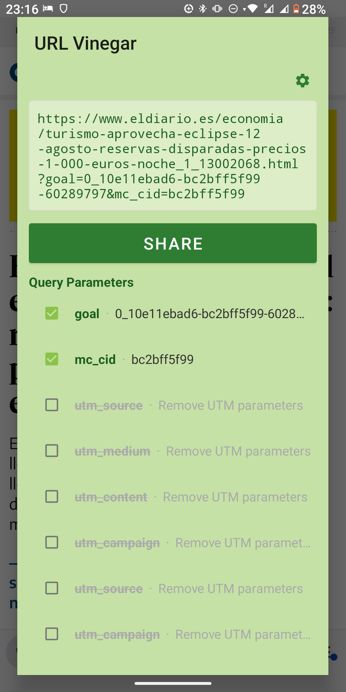
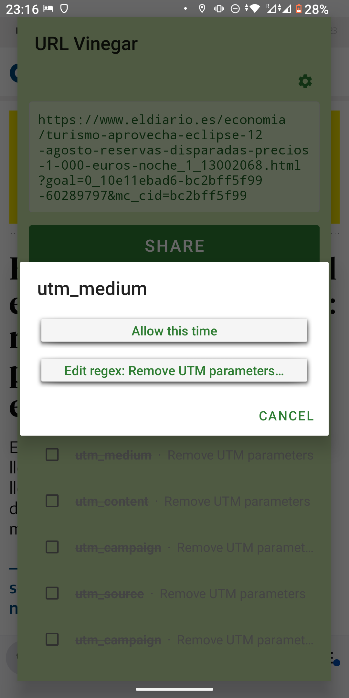
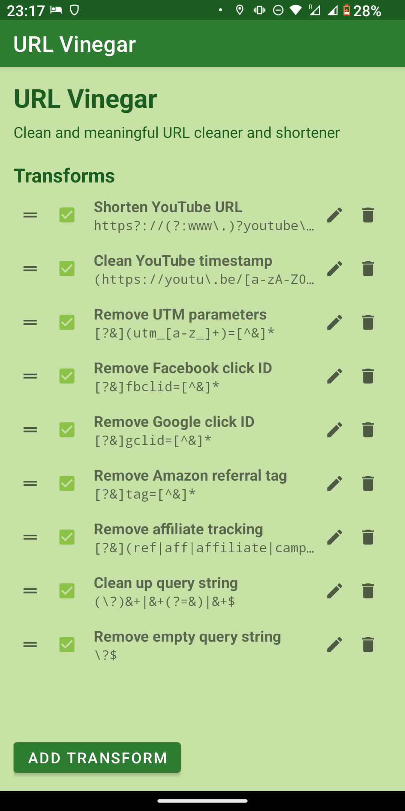

  

# URL Vinegar
Small customizable URL cleaner.

## Features
- **Privacy** - Removes UTM, fbclid, gclid, and other tracking parameters
- **Real-time preview** - See cleaned URL update as you toggle parameters in or out
- **One-click operation** - Prominent Share button for quick cleaned URL sharing
- **Minimal size** - 3.4 MB used in Android storage
- **YouTube URL shortener** - Converts `youtube.com/watch?v=xxx` to `youtu.be/xxx` (preserves timestamps)
- **Regex transforms** - User can edit and apply any regex transform for flexible URL manipulation

## Screenshots

  
  
  
  

# RFC 2119 Requirements (for AI assisted development)

## Objective

- URL Vinegar MUST allow User to clean-up URLs of tracking info and any unwanted metadata.
- The app MUST be able to apply changes and re-share with a single click when defaults are okay.
- The app SHALL allow User to tweak options on a shared URL, interactively showing the result.
- The app SHALL enable tweaking settings on the fly.

## 2. URL Interception

### 2.1 Browser Registration
- The application MUST register as a browser handler for `http` and `https` schemes.
- The application MUST register to receive `ACTION_SEND` intents with `text/plain` MIME type.
- The application MUST be selectable from the system share sheet when sharing URLs.

### 2.2 URL Reception
- The application MUST accept URLs via `ACTION_VIEW` intents (browser selection).
- The application MUST accept URLs via `ACTION_SEND` intents (share action).
- The application MUST extract URLs from `Intent.EXTRA_TEXT` when received via share.

---

## 3. Processing Dialog

### 3.1 Dialog Display
- When receiving a URL, the application MUST display a processing dialog before sharing.
- The dialog MUST show a preview of the cleaned URL.
- The dialog MUST update the preview in real-time when the user modifies selections.
- The dialog MUST have a prominent Share button directly below the URL preview.
- Settings button MUST be in the top right corner.

### 3.2 Parameter List
- The dialog MUST display all query parameters from the original URL.
- Parameters kept after transform processing MUST be listed first, followed by removed parameters.
- Kept parameters MUST show their name and value.
- Removed parameters MUST show their name and the name of the transform that removed them.
- Each parameter MUST have a checkbox to toggle keep/remove.
- Kept parameters MUST be checked by default.
- Parameters removed by transforms MUST be unchecked by default.
- Parameters removed by transforms MUST show strikethrough text.

### 3.3 Parameter Tracking
- The application MUST step through transforms one-by-one to determine which transform removed each parameter.
- Each removed parameter MUST be attributed to the specific transform that removed it.
- Parameters that survive all transforms MUST be treated as kept.

### 3.4 Parameter Actions
- Tapping any parameter MUST open an action dialog with clearly styled buttons.
- For kept parameters, the dialog MUST offer:
  - "Remove this time" — removes the parameter for the current URL only.
  - "Add removal regex…" — opens the add transform dialog pre-filled with a removal pattern.
- For removed parameters, the dialog MUST offer:
  - "Allow this time" — restores the parameter for the current URL only.
  - "Edit regex: {transform name}…" — opens the configuration activity to edit the responsible transform.

### 3.5 Adding Transforms
- The dialog MUST provide a (+) button to add a new transform.
- When adding a transform, the application MUST prompt for:
  - Name (REQUIRED)
  - Regex pattern (REQUIRED)
  - Replacement string (OPTIONAL, defaults to empty string)
- The add dialog MUST show a live preview of the transform applied to the current URL.
- After adding a transform, the application MUST ask whether to save it to configuration.
- If the user chooses "This time only", the transform applies only to current URL.

### 3.6 Query Parameter Display
- The parameter list section header MUST say "Query Parameters".
- The settings button (⚙) in the top right provides full configuration access.

### 3.7 Query Parameter Checkbox Behavior
- Checking a parameter MUST immediately keep it in the cleaned URL.
- Unchecking a parameter MUST immediately remove it from the cleaned URL.
- The URL preview MUST update in real-time when checkboxes are toggled.

### 3.8 Dialog Actions
- The dialog MUST provide a prominent "Share" button that shares the cleaned URL.
- The dialog MUST provide a "Cancel" button that dismisses without action.
- The dialog MUST provide a "Copy" button to copy the cleaned URL.
- The dialog MUST provide a settings button (⚙) in top right for full configuration access.

---

## 4. URL Processing

### 4.1 Transform Application
- Transforms MUST be applied in their configured order.
- Only transforms that are both matching and enabled MUST be applied.
- Each transform MUST use the regex pattern for matching and replacement.
- The replacement string MAY be empty (effectively deleting matched content).
- Invalid regex patterns MUST NOT crash the application; they SHOULD be highlighted in red and skipped.

### 4.2 Query Parameter Filtering
- After transforms are applied, query parameters MUST be filtered.
- Only parameters with checkbox checked MUST be retained.
- The filtered query string MUST be properly formatted with `&` separators.
- If no parameters are kept, the URL MUST NOT include a `?` character.

### 4.3 URL Reconstruction
- The cleaned URL MUST preserve a valid scheme (`http` or `https`), otherwise become red and cannot be reshared.
- The scheme MAY be affected by a regex transform.
- The cleaned URL MAY change the original host (e.g., youtube.com → youtu.be).
- The cleaned URL MUST include only the filtered query parameters.

---

## 5. Configuration

### 5.1 Configuration Activity
- The application MUST provide a configuration activity accessible from the launcher.
- When launched without a URL intent, the application MUST open the configuration activity.
- The configuration activity MUST allow management of transforms.

### 5.2 Transform Configuration
- The configuration MUST store an ordered list of transforms.
- Each transform MUST have:
  - Name (string, REQUIRED)
  - Regex pattern (string, REQUIRED)
  - Replacement string (string, REQUIRED, MAY be empty)
  - Enabled state (boolean, REQUIRED)
- The user MUST be able to add, edit, delete, and reorder transforms.
- Transform order MUST be persisted and respected during processing.

### 5.3 Default Configuration
- The application MUST include default transforms for:
  - YouTube URL shortening (`youtube.com/watch?v=xxx` → `youtu.be/xxx`)
  - UTM parameters removal
  - Facebook click ID (`fbclid`) removal
  - Google click ID (`gclid`) removal
  - Amazon referral tag removal
  - Generic affiliate tracking removal
  - Query string cleanup

### 5.4 Persistence
- All configuration MUST be persisted across application restarts.
- Configuration MUST be stored using SharedPreferences with JSON serialization.

---

## 6. Sharing

### 6.1 Share Intent
- When the user confirms sharing, the application MUST create an `ACTION_SEND` intent.
- The intent MUST include the cleaned URL in `EXTRA_TEXT`.
- The intent MUST have MIME type `text/plain`.
- The application MUST display a system chooser for selecting the target application.

### 6.2 Post-Share Behavior
- After initiating the share, the application MUST finish the current activity.
- The application MUST NOT remain in the foreground after sharing.

---

## 7. User Interface

### 7.1 Theme
- The application MUST use a lime/dark green color scheme.
- Background SHOULD be light lime (#C5E1A5).
- Primary buttons MUST be dark green (#2E7D32) with white text.
- Text MUST be dark green (#1B5E20) for readability.

### 7.2 App Icon
- The icon MUST be an adaptive icon with dark green background.
- The foreground MUST show a lime spray bottle with "UV" text.
- The icon MUST include a cleaning cloth element.

### 7.3 Visual Feedback
- Removed query parameters MUST use strikethrough text.
- Removed query parameters MUST show the name of the transform that removed them.
- Kept query parameters MUST show their value.
- The URL preview MUST update immediately when selections change.
- Invalid regex patterns MUST be highlighted in red.

### 7.4 Parameter Action Buttons
- Action dialogs for parameters MUST use clearly styled buttons.
- Buttons MUST be visually distinct from plain text.

---

## 8. Size Optimization

### 8.1 APK Size
- The release APK MUST be under 2 MB.
- The application MUST enable R8/ProGuard minification for release builds.
- The application MUST enable resource shrinking for release builds.

### 8.2 Dependencies
- The application MUST minimize external dependencies.
- The application MUST NOT include unnecessary native libraries.
- The application MUST use built-in Android/Java regex functionality.

---

## 9. Error Handling

### 9.1 Invalid Regex
- Invalid regex patterns MUST NOT cause application crashes.
- Invalid regex patterns MUST be silently skipped during processing.
- Invalid regex patterns MUST be highlighted in red in the UI.

### 9.2 Malformed URLs
- Malformed URLs MUST NOT cause application crashes.
- If a URL cannot be parsed, the application SHOULD share it unmodified.

---

## 10. Compatibility

### 10.1 Android Version
- The application MUST support Android API level 21 (Lollipop) and above.
- The application MUST target Android API level 34.

### 10.2 Permissions
- The application MUST NOT require any permissions.
